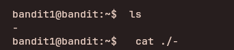

## Access Information

SSH Portal:
ssh bandit0@bandit.labs.overthewire.org -p 2220

Website:
https://overthewire.org/wargames/bandit/

Password for each level is stored inside the current level and used to log into the next.

Example:
ssh bandit1@bandit.labs.overthewire.org -p 2220

---


## Level 0 → 1

### Objective
Log in via SSH and retrieve the password for the next level.

Password for the `bandit0` login is `bandit0`

### Enumeration
After login, list files in the home directory.

### Steps to solve
```bash
ls
cat readme
```
---


---

### explanation

```bash
ls  -> lists all subfiles and folders in that directory
cat -> displays the file content in the terminal itself
```
---