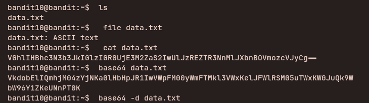

## Access Information

SSH Portal:
ssh bandit10@bandit.labs.overthewire.org -p 2220

Website:
https://overthewire.org/wargames/bandit/

Password for each level is stored inside the current level and used to log into the next.

---

## Level 10 → 11

### Steps to solve
```bash
ls
file data.txt
base64 -d data.txt
```
---


---

### explanation

These commands determine the file type and decode base64-encoded content:

- `ls` — lists files in the current directory so you can confirm `data.txt` is present.
- `file data.txt` — shows the file type (text, ASCII, base64-encoded text, etc.). Always run `file` first to understand what you're dealing with.
- `base64 -d data.txt` (or `base64 --decode data.txt`) — decodes base64 input from `data.txt` and writes the decoded bytes to stdout. To save the decoded output, redirect to a file: `base64 -d data.txt > decoded.bin`.
---