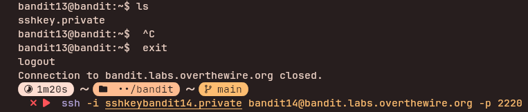

## Access Information

SSH Portal:
ssh bandit13@bandit.labs.overthewire.org -p 2220

Website:
https://overthewire.org/wargames/bandit/

Password for each level is stored inside the current level and used to log into the next.

---

## Level 13 → 14

### Steps to solve
```bash
ls
ssh -i filename bandit14@bandit.labs.overthewire.org -p 2220
```
this directly logs into the bandit14shell, from then to get the password 

```bash
cat /etc/bandit_pass/bandit14
```

---
