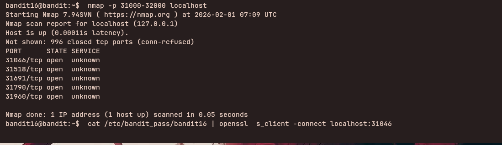

## Access Information

SSH Portal:
ssh bandit16@bandit.labs.overthewire.org -p 2220

Website:
https://overthewire.org/wargames/bandit/

Password for each level is stored inside the current level and used to log into the next.

---

## Level 16 → 17

### Steps to solve
```bash
nmap -p 31000-32000 localhost
cat /etc/bandit_pass/bandit15 | openssl s_client -connect localhost:31046

you can repeat the same for all shown ports
```
---


### explanation

This level uses OpenSSL's `s_client` to open an SSL/TLS connection to a local service and submit the current level's password over the encrypted channel.

- `openssl s_client -connect localhost:30001` — opens a TLS connection to `localhost` on port `30001`. The command negotiates TLS and then presents an interactive session where you can read the server's output and type input to send.

Usage details and variations:

- To interactively submit the password, run `openssl s_client -connect localhost:30001`, then type or paste the password followed by Enter. The server will respond over the secure connection.
- To non-interactively submit the password from a file, pipe or redirect the password into `s_client`:

    - `cat /etc/bandit_pass/bandit16 | openssl s_client -connect localhost:30001` — sends the password read from the file into the TLS session. Be careful with file permissions and the presence of trailing newlines when piping.
    - Alternatively: `openssl s_client -connect localhost:30001 < /etc/bandit_pass/bandit16`.

    Network discovery and workflow:

    - `nmap -p 31000-32000 localhost` — scan `localhost` for open TCP ports in the range `31000`–`32000`. `nmap` will report which ports are open and, when possible, attempt to identify the service running on each port. This helps you discover where a listening challenge service is running.

    - Typical workflow: run `nmap` to find the open service port, then connect with the appropriate client (here `openssl s_client`) to interact with it. For example, if `nmap` shows `30001/tcp open`, use `openssl s_client -connect localhost:30001` to connect.

    Additional tips:

    - Use `nmap -sV -p 31000-32000 localhost` to probe version/service information when available (`-sV`), which can help identify whether a port speaks plain TCP, TLS, or an application protocol.
    - Scanning with `nmap` as a normal user against `localhost` is generally safe in this exercise, but avoid wide network scans without permission.
    - If `nmap` finds a port but an interactive connection fails, try verbose `openssl s_client -connect host:port -crlf -servername host` or use `-starttls` for protocols that require STARTTLS (if applicable).
    - When automating submission of a password, prefer redirecting from a file with strict permissions (`openssl s_client -connect host:port < /path/to/file`) over placing secrets on the command line.
    - Always inspect service output carefully; do not store or commit discovered passwords to version control.

    ---
---