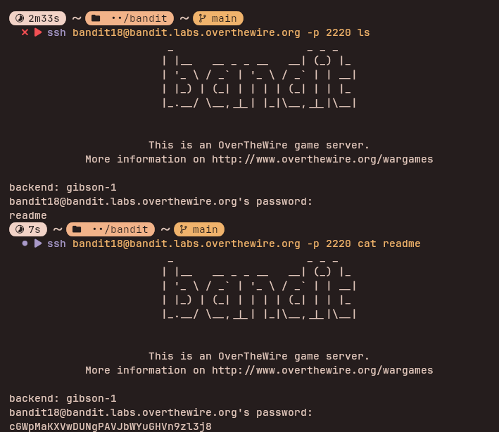

## Access Information

SSH Portal:
ssh bandit18@bandit.labs.overthewire.org -p 2220

Website:
https://overthewire.org/wargames/bandit/

Password for each level is stored inside the current level and used to log into the next.

---

## Level 18 → 19

### Steps to solve
```bash
ssh bandit18@bandit.labs.overthewire.org -p 2220 ls
ssh bandit18@bandit.labs.overthewire.org -p 2220 cat readme
```
---


### explanation

These commands run single commands on the remote Bandit server over SSH to list files and display the `readme` file containing the next-level password.

- `ssh bandit18@bandit.labs.overthewire.org -p 2220 ls` — connects to the remote account and runs `ls` on the remote side. When you provide a command after the SSH target, SSH executes that command on the remote host and then exits.
- `ssh bandit18@bandit.labs.overthewire.org -p 2220 cat readme` — connects and runs `cat readme` remotely; the contents of `readme` (the password) are printed to your local terminal.
---