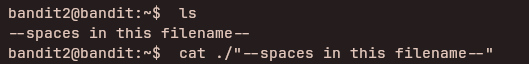

## Access Information

SSH Portal:
ssh bandit2@bandit.labs.overthewire.org -p 2220

Website:
https://overthewire.org/wargames/bandit/

---

## Level 1 → 2

### Objective
Log in via SSH and retrieve the password for the next level.

### Enumeration
After login, list files in the home directory.

### Steps to solve
```bash
ls
cat ./"--spaces in the filename" 
        or
cat < "--space in the filename"
```

---



### Explanation

- `ls` lists files in the directory.
- The file containing the password is named `-`, which some commands interpret as an option/flag.

