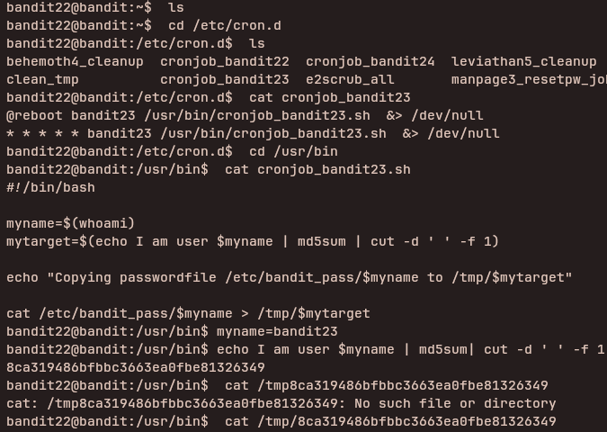

## Access Information

SSH Portal:
ssh bandit22@bandit.labs.overthewire.org -p 2220

Website:
https://overthewire.org/wargames/bandit/

Password for each level is stored inside the current level and used to log into the next.

---

## Level 22 → 23

### Steps to solve
```bash
ls
cat /etc/cron.d
cat cronjob_bandit23
cd /usr/bin
cat cronjob_bandit23.sh
myname=bandit23
echo I am user $myname | md5sum | cut -d ' ' -f 1

then use the hash got from the above command sa the tmp file

cat /tmp/hash
```
---


### explanation

- `echo I am user $myname | md5sum | cut -d ' ' -f 1` — computes the MD5 hash of the string `I am user bandit23`: this prints the exact hash the script is intended to generate for bandit22 but we are meant to get the pass for bandit23 so the variable `myname=bandit23`
	- `echo` prints the phrase
	- `md5sum` computes the MD5 digest and prints: `<hash>  -`.
	- `cut -d ' ' -f 1` extracts just the hash value.

Example:

```
myname=bandit23
hash=$(echo -n "I am user $myname" | md5sum | cut -d ' ' -f1)
cat /tmp/$hash
```

---