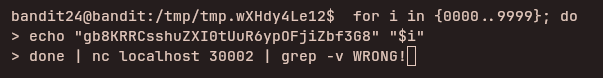

## Access Information

SSH Portal:
ssh bandit24@bandit.labs.overthewire.org -p 2220

Website:
https://overthewire.org/wargames/bandit/

Password for each level is stored inside the current level and used to log into the next.

---

## Level 24 → 25

### Steps to solve
```bash
for i in {0000..9999}; do
>echo "bandit24pass" "$i"
>done | nc localhost 30002 | grep -v WRONG!
```
---


### explanation

This sequence brute-forces a 4-digit PIN by sending guesses to a local network service and filtering out wrong responses:

- `for i in {0000..9999}; do ... done` — iterates all 4-digit codes from `0000` to `9999` (the brace expansion preserves leading zeros). Alternative: `seq -w 0 9999`.
- `echo "bandit24pass" "$i"` — prints the username/password pair (or the expected input format the service requires). Use `printf` if you need precise control over newlines: `printf '%s %s\n' bandit24pass "$i"`.
- `| nc localhost 30002` — pipes each guess to `nc`, which opens a TCP connection to the service on port `30002`. The service evaluates each guess and writes a response.
- `| grep -v WRONG!` — filters out lines containing `WRONG!`, leaving only the successful response(s). When the correct PIN is submitted the service responds with the next-level password (not `WRONG!`) and that line passes through the filter.

---