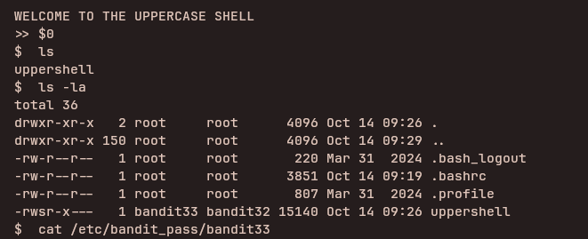

## Access Information

SSH Portal:
ssh bandit32@bandit.labs.overthewire.org -p 2220

Website:
https://overthewire.org/wargames/bandit/

Password for each level is stored inside the current level and used to log into the next.

---

## Level 32 → 33

### Steps to solve
```bash
connect with the pass using the ssh method

then in the uppercase shell

$0
cat /etc/bandit_pass/bandit33

```


### explanation

This level places you into a restricted "uppercase" shell when you log in. The intended solution is to use the shell's behavior to execute `cat` on the next level's password file. The Steps show how to invoke the program using the special `$0` invocation.

- Connect via SSH using the level's password:

  - `ssh bandit32@bandit.labs.overthewire.org -p 2220`

- In the uppercase shell, run the shown command (the `$0` invocation runs the underlying program with the provided arguments):

  - `$0 cat /etc/bandit_pass/bandit33`
---