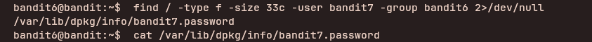

## Access Information

SSH Portal:
ssh bandit6@bandit.labs.overthewire.org -p 2220

Website:
https://overthewire.org/wargames/bandit/

Password for each level is stored inside the current level and used to log into the next.

---

## Level 6 → 7

### Steps to solve
```bash
find / -type f -size 33c -user bandit7 -group bandit6 2>/dev/null
cat /path/to/file

```
---


---

### explanation

This level searches the filesystem for a regular file that matches specific ownership and size criteria, then displays its contents. Breakdown:

- `find / -type f -size 33c -user bandit7 -group bandit6 2>/dev/null`:
	- `/` — start the search at the filesystem root so matches can be found anywhere.
	- `-type f` — look only for regular files (not directories, symlinks, etc.).
	- `-size 33c` — match files whose size is exactly 33 bytes; the `c` suffix means "bytes".
	- `-user bandit7` — match files owned by user `bandit7`.
	- `-group bandit6` — match files belonging to group `bandit6`.
	- `2>/dev/null` — redirect error output (permission denied messages) to `/dev/null` so the listing is cleaner.

- The command prints one or more file paths that meet the criteria. Use the returned path with `cat` to read the file:

---