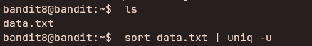

## Access Information

SSH Portal:
ssh bandit8@bandit.labs.overthewire.org -p 2220

Website:
https://overthewire.org/wargames/bandit/

Password for each level is stored inside the current level and used to log into the next.

---

## Level 8 → 9

### Steps to solve
```bash
ls
sort data.txt | uniq -u
```
---


---

### explanation

These commands find lines in `data.txt` that occur exactly once (unique lines):

- `ls` — lists files in the current directory so you can confirm `data.txt` is present.
- `sort data.txt | uniq -u` — `sort` orders all lines so duplicates become adjacent; `uniq -u` then prints only lines that are unique (occur exactly once) in the sorted input. Together this returns lines that appear a single time in the file.

Tips:

- `uniq -u` requires sorted input to correctly identify unique lines; without `sort` it only compares adjacent lines.
- If the file is large, consider `LC_ALL=C sort` for faster, byte-wise sorting.
---